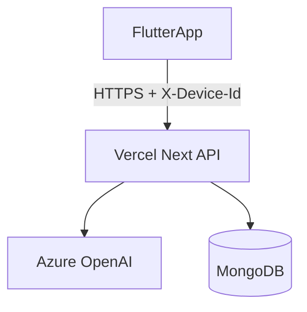

# Flutter 앱 스토어 출시 가이드 (Math Lens Tutor)

백엔드·웹은 **Vercel**, 분석은 **Azure OpenAI**, 데이터는 **MongoDB**, 모바일 클라이언트는 **`flutter_app/`** 기준입니다.  
이 문서는 **Apple·Google 개발자 계정 권한을 확보했다는 전제**로, 혼자 또는 소규모 팀이 스토어까지 올리기 위한 순서를 정리합니다.

## 현재 아키텍처 한눈에

| 구분 | 역할 |
| --- | --- |
| `src/app/api/*` | 분석(`analyze`), 유사 문제 생성, 답안 제출, 대시보드 JSON API |
| Azure OpenAI | 서버에서만 호출. 비전(이미지) 가능한 배포 필요 |
| MongoDB | 제출 이미지, 분석 결과, 문제 세트, 풀이 기록, API 에러 로그 등 |
| Vercel | Next.js 웹 + API 배포(루트). 상세는 `docs/vercel-deploy-guide-ko.md` |
| `flutter_app/` | iOS / Android 스토어용 네이티브 앱 |
| `mobile/` | 과거 Expo 예제성 폴더. 스토어 타깃은 **`flutter_app/`** |

**로그인은 없음.** 앱은 `shared_preferences`에 만든 **익명 기기 ID**를 `X-Device-Id` 헤더로 보내고, 서버는 `device:<id>` 형태로 기록을 구분합니다.



Azure 키·Mongo URI·Vercel 토큰은 **앱 바이너리에 넣지 않습니다.**

## 배포 전 필수 연결 (계정 권한이 있을 때 한 번에 할 일)

### 1. GitHub ↔ Vercel (자동 배포)

- Vercel 대시보드에서 **GitHub 계정 연결**(Login Connection) 후, 레포 [SuperWallaby/math-lens-tutor](https://github.com/SuperWallaby/math-lens-tutor) Import  
- 프로덕션 브랜치는 보통 `main`  
- 웹/API만 빌드되도록 레포에 `.vercelignore`(Flutter·Expo 폴더 제외)가 이미 있는지 확인

### 2. 서버 환경 변수 (Vercel Project → Settings → Environment Variables)

프로덕션에서 실제 분석·저장을 쓰려면 예시로 다음을 설정합니다.

| 변수 | 용도 |
| --- | --- |
| `AZURE_OPENAI_ENDPOINT` | `https://<리소스>.openai.azure.com` |
| `AZURE_OPENAI_API_KEY` | Azure 키 |
| `AZURE_OPENAI_DEPLOYMENT` | 비전 지원 배포명 (예: `gpt-4o`) |
| `AZURE_OPENAI_API_VERSION` | 선택 |
| `MONGODB_URI` | Atlas 등 연결 문자열 |
| `MONGODB_DB_NAME` | 선택, 미설정 시 코드 기본값 사용 |

MongoDB Atlas는 **Network Access**에서 Vercel(동적 IP)과 정책을 맞춰야 합니다.

### 3. 프로덕션 URL 확정 (Flutter에 넘길 값)

웹이 배포된 **HTTPS 기준 URL**을 정합니다. (예: Vercel 프로젝트에 부여된 프로덕션 도메인)  
Flutter 실행·스토어 빌드 시:

```bash
cd flutter_app
flutter run --dart-define=API_BASE_URL=https://<프로덕션-도메인>
```

```bash
flutter build ipa --dart-define=API_BASE_URL=https://<프로덕션-도메인>
flutter build appbundle --dart-define=API_BASE_URL=https://<프로덕션-도메인>
```

`API_BASE_URL`이 틀리면 앱이 잘못된 서버로 요청합니다. **스토어 제출 전에 실제 기기에서 한 번씩** 확인하세요.

### 4. 스토어용 정책 URL

- 개인정보 처리방침: 웹에 `/privacy` 페이지가 있으므로  
  `https://<프로덕션-도메인>/privacy`  
  를 App Store Connect / Play Console에 그대로 넣을 수 있습니다.  
- 수집 항목(사진, 학습 기록, 익명 기기 ID, Azure·Mongo 처리)은 해당 페이지 문구와 일치시키세요.

## 앱 식별자·권한 (코드에서 손볼 위치)

| 플랫폼 | 항목 | 위치(레포 기준) |
| --- | --- | --- |
| Android | `applicationId` | `flutter_app/android/app/build.gradle.kts` |
| iOS | Bundle Identifier | Xcode → `flutter_app/ios/Runner.xcodeproj` Runner 타깃 |
| Android | 카메라·저장소 등 권한 문구 | `flutter_app/android/app/src/main/AndroidManifest.xml` |
| iOS | 사진·카메라 사용 목적 문구 | `flutter_app/ios/Runner/Info.plist` |

회사/브랜드 정책에 맞게 **역도메인 스타일 ID** 하나로 통일하는 것을 권장합니다. (예: `com.company.mathlenstutor`)

## Apple App Store (계정 있을 때 체크리스트)

- [ ] Apple Developer Program 활성
- [ ] App Store Connect에서 새 앱 생성, Bundle ID와 Xcode 설정 일치
- [ ] 스크린샷·설명·연령·카테고리·개인정보 처리방침 URL
- [ ] 카메라·사진 접근과 **앱 설명·Info.plist 문구** 일치
- [ ] TestFlight 내부/외부 테스트 후 심사 제출
- [ ] `.ipa` 빌드: 로컬 Xcode 서명 또는 CI (인증서·프로비저닝 프로파일)

```bash
cd flutter_app
flutter build ipa --dart-define=API_BASE_URL=https://<프로덕션-도메인>
```

## Google Play (계정 있을 때 체크리스트)

- [ ] Play Console 개발자 계정·결제 프로필
- [ ] 새 앱 생성, 패키지 이름 확정 후 **변경 불가**라서 신중히 결정
- [ ] 앱 서명: Play App Signing 권장
- [ ] 데이터 보안(Data safety) 설문: 사진·학습 데이터·기기 식별자 수집 여부와 일치
- [ ] 내부 테스트 트랙에 `.aab` 업로드 후 프로덕션 트랙 심사

```bash
cd flutter_app
flutter build appbundle --dart-define=API_BASE_URL=https://<프로덕션-도메인>
```

## 운영 시 알아둘 것

- **사용자 삭제·문의**: 스토어 정책상 연락처(이메일 등)를 개인정보 처리방침에 명시하는 것이 안전합니다.
- **Mongo 미설정**: 서버가 메모리 모드로 동작할 수 있어 **재배포 시 데이터 소실** 가능. 프로덕션은 Mongo 연결을 권장합니다.
- **에러 추적**: 서버는 Mongo에 `api_error_logs` 등으로 에러를 남길 수 있습니다. 앱에는 사용자용 짧은 메시지, 상세는 서버 로그로 분리하는 방식입니다.

## 관련 문서

- 웹·API Vercel 배포: `docs/vercel-deploy-guide-ko.md`
- Flutter 백엔드 URL: `flutter_app/README.md`
