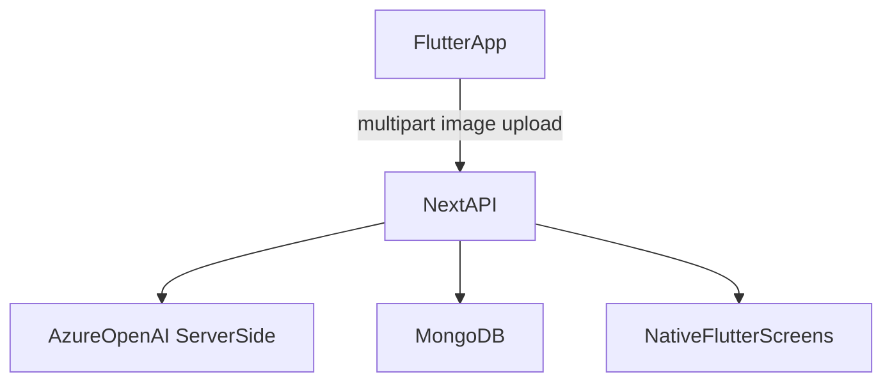

# Flutter 앱 출시 준비 가이드

이 문서는 `Math Lens Tutor`를 **Flutter 네이티브 앱**으로 앱스토어와 플레이스토어에 올리기 전에 알아야 할 내용을 정리합니다. Apple/Google 개발자 계정이 없어 회사 동료에게 부탁해야 하는 상황을 기준으로 작성했습니다.

## 현재 앱 구조

| 구분 | 역할 |
| --- | --- |
| `src/app/api/*` | Azure OpenAI 분석, 문제 생성, 답안 제출, 대시보드 JSON API |
| `MongoDB` | 제출 이미지, 분석 결과, 문제 세트, 풀이 기록, 에러 로그 저장 |
| `flutter_app/` | iOS/Android 네이티브 앱 클라이언트 |
| `mobile/` | 이전 Expo WebView 백업. 신규 앱 기준은 `flutter_app/` |

Azure OpenAI 키와 MongoDB URI는 앱에 넣지 않습니다. Flutter 앱은 배포된 Next.js 백엔드 API만 호출하고, 로그인 대신 익명 기기 ID로 학습 기록을 분리합니다.



## 개발자가 먼저 준비할 것

1. Next.js 백엔드를 HTTPS로 배포합니다. 예: Vercel
2. Flutter 실행/빌드 시 백엔드 URL을 넘깁니다.

```bash
cd flutter_app
flutter run --dart-define=API_BASE_URL=https://your-app.vercel.app
```

3. 앱 식별자를 회사 표준에 맞춥니다.

- Android: `flutter_app/android/app/build.gradle.kts`의 `applicationId`
- iOS: Xcode에서 Runner target의 Bundle Identifier

예: `com.company.mathlenstutor`

4. 카메라/사진 권한 문구를 확인합니다.

- Android: `flutter_app/android/app/src/main/AndroidManifest.xml`
- iOS: `flutter_app/ios/Runner/Info.plist`

## 동료에게 이렇게 부탁하면 됨

아래 문구를 그대로 복사해서 보내도 됩니다.

---

안녕하세요. 수학 풀이 분석 앱을 Flutter 네이티브 앱으로 스토어에 올리려고 합니다. 제 Apple/Google 개발자 계정이 아직 없어서 회사 개발자 계정 기준으로 진행을 부탁드리고 싶습니다.

현재 구조는 이렇습니다.

- 앱 클라이언트: Flutter (`flutter_app/`)
- 백엔드: 배포된 Next.js API
- AI/MongoDB 키: 앱에 포함하지 않고 서버에서만 사용
- 로그인: 초기 버전은 익명 기기 ID 방식
- 앱 기능: 풀이 사진 촬영/선택 → AI 분석 → 유사 문제 풀이 → 학습 대시보드

확인/지원 부탁드리는 것:

1. 회사 표준 앱 식별자 확정
   - iOS Bundle ID: 예) `com.company.mathlenstutor`
   - Android package/applicationId: 예) `com.company.mathlenstutor`

2. 개발자 계정 접근 방식
   - 옵션 A: 동료님이 Apple Developer / Play Console에서 앱 생성, 빌드 업로드, 심사 제출까지 담당
   - 옵션 B: 저를 필요한 권한으로 초대해 주시고, 제가 빌드 파일과 스토어 정보를 준비

3. 빌드/서명 방식
   - Flutter 빌드는 `flutter build appbundle` / `flutter build ipa` 기준입니다.
   - iOS는 Apple 인증서/프로비저닝 설정이 필요합니다.
   - Android는 Play App Signing과 업로드 키 정책 확인이 필요합니다.

제가 준비해서 전달할 수 있는 것:

- 배포된 백엔드 URL: `[https://...]`
- 앱 이름: `[Math Lens Tutor 또는 회사에서 정한 이름]`
- 앱 설명/스크린샷/테스트 계정
- 개인정보처리방침 URL
- Flutter 빌드 명령과 산출물

가능하실 때 회사 표준 Bundle ID/package 이름과, 제가 계정에 초대받아 진행해도 되는지 알려주시면 다음 단계 진행하겠습니다. 감사합니다.

---

## Apple App Store 체크리스트

- [ ] Apple Developer Program 가입 계정 확인
- [ ] App Store Connect에서 새 앱 생성
- [ ] Bundle ID 확정
- [ ] 앱 이름, 부제, 카테고리, 연령 등급 작성
- [ ] 개인정보처리방침 URL 준비
- [ ] 카메라/사진 접근 사유가 앱 설명과 일치하는지 확인
- [ ] TestFlight 내부 테스트
- [ ] `.ipa` 업로드 후 심사 제출

iOS 빌드 예:

```bash
cd flutter_app
flutter build ipa --dart-define=API_BASE_URL=https://your-app.vercel.app
```

실제 iOS 배포는 Xcode 서명 설정과 Apple 계정 권한이 필요합니다.

## Google Play 체크리스트

- [ ] Google Play Console 개발자 계정 확인
- [ ] 새 앱 생성
- [ ] Android package/applicationId 확정
- [ ] 앱 서명 방식 결정: Play App Signing 권장
- [ ] 데이터 보안 설문 작성
- [ ] 카메라/사진 권한 사용 사유 작성
- [ ] 내부 테스트 트랙 업로드
- [ ] `.aab` 업로드 후 심사 제출

Android 빌드 예:

```bash
cd flutter_app
flutter build appbundle --dart-define=API_BASE_URL=https://your-app.vercel.app
```

## 개인정보와 심사에서 중요한 점

이 앱은 사용자의 풀이 사진과 학습 데이터를 다룹니다. 스토어 심사와 개인정보처리방침에서 최소한 아래 내용을 설명해야 합니다.

- 사용자가 선택/촬영한 풀이 사진을 서버로 업로드함
- 로그인 없이 익명 기기 ID로 기기별 학습 기록을 구분함
- AI가 문제와 풀이 과정을 분석함
- 분석 결과, 문제 풀이 기록, 정답률, 약점 개념을 저장함
- Azure OpenAI와 MongoDB 등 외부 서비스가 처리에 사용될 수 있음
- 서비스 품질 개선과 장애 조사 목적으로 API 에러 로그를 MongoDB에 저장할 수 있음
- 사용자가 데이터 삭제를 요청할 수 있는 연락처

## 출시 전 현실적인 준비물

- 앱 아이콘: 1024x1024 원본
- 스플래시/브랜드 컬러
- iPhone/Android 스크린샷
- 앱 설명 한글/영문
- 지원 이메일
- 개인정보처리방침 URL: 배포 후 `/privacy`
- 테스트용 계정 또는 데모 플로우 설명
- 프로덕션 백엔드 URL

## 이번 레포의 다음 단계

1. 백엔드를 Vercel 등 HTTPS URL로 배포합니다.
2. `flutter_app`을 실제 기기에서 `--dart-define=API_BASE_URL=...`로 실행해 사진 업로드를 확인합니다.
3. 회사 표준 식별자로 `applicationId`와 Bundle ID를 확정합니다.
4. 앱 아이콘/스크린샷/개인정보처리방침을 준비합니다.
5. 동료 계정으로 TestFlight / Play 내부 테스트를 먼저 올립니다.
